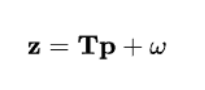
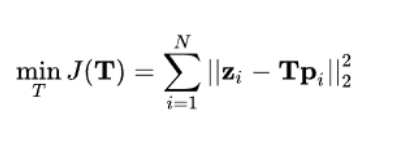
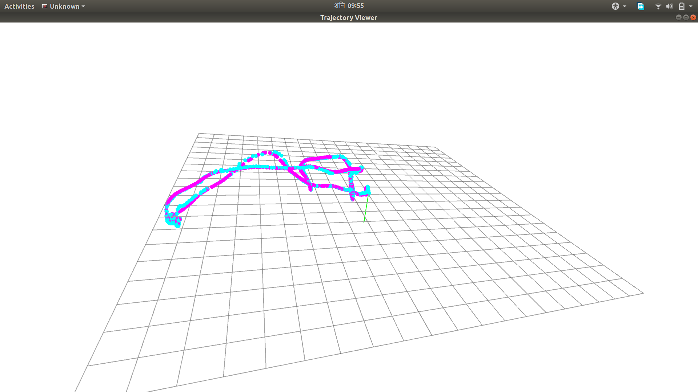

# Lie Group and Lie Algebra

Li group is also a group, an abstract concept, a group with continuous (smooth) nature.
Space rotation: rotation matrix group SO (3), space rotation plus smooth movement (rigid body): transformation matrix group SE (3).

## Why SLAM uses Lie Group 

We observe point P in the inertial system, and the resulting observation value is Z. When we know P and Z, we need to obtain the position and attitude T of the camera at this time. When obtaining T, due to the error of our observation, there is an error in the solution of T.

We use the minimum error as our optimization index. The formula becomes that

we need to perform iterative solution here. The iterative solution uses the gradient descent method. We need to know that the matrix J derivates T, and the matrix derivation appears here. But there is a problem here. The addition of the matrix is ​​not closed, and the addition needs to be used when iterating. Therefore, even if the matrix can be derived, it cannot solve the problem that the **addition is not available** .

Lie groups have a continuous nature, because we convert our problem to a structure that applies Lie groups, which solves the problem that  addition is not available. And how to convert? Lie algebra is used here .

**Lie algebra core**: the matrix is ​​converted into a vector, and the vector is additive

## Trajectory Error output

