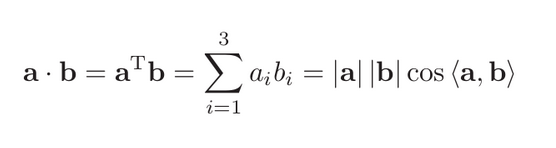
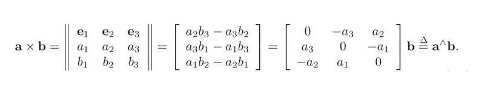

# Linear Algebra

You will learn knowledge about rotation matrices, quaternions, Euler angles, and practice them.

```Linear Algebra``` :  Operation on matrix and  vector 

Operations : 
1. Scalar multiplication
2. Vector Addition
3. Vector Subtraction
4. Inner product
5. Outer product
6. Multiplication
7. Addition


## Inner Product 
The inner product can also describe the projection relationship between vectors .





## Outer Product 
The result of the outer product is a vector whose direction is perpendicular to the
two vectors, and the length is |a| |b| ⟨a, b⟩, which is also the area of the quadrilateral of the two vectors .





## Transformation

1. ROTATION MATRIX 

The components of the rotational  matrix are the inner product of the two coordinate system bases .

The rotation matrix is an orthogonal matrix, its inverse (ie, transpose)
describes an opposite rotation .

R12  means “rotation the vector from coordinate system 2 to coordinate system 1”.

2. Homogeneous Coordinates

This is a mathematical trick: we add 1 at the end of a 3D vector and turn it into a
4D vector called homogeneous coordinates.

For this four-dimensional vector, we can write the rotation and translation in one matrix, making the whole relationship a linear relationship.


## Using Eigen Library

Installation

```
sudo apt install libeigen3-dev
```
Linking 
```
find_package(Eigen3 3.3 REQUIRED)
include_directories("/usr/include/eigen3" )

```

Header File

`````#include <Eigen/Core> `````: Consist of core , must include for using other module

```#include <Eigen/Dense> ```: Algebraic operations of dense matrices (inverse, eigenvalues, etc.)

```#include <Eigen/Geometry> ```: Perform Geometry algebra related operation.


