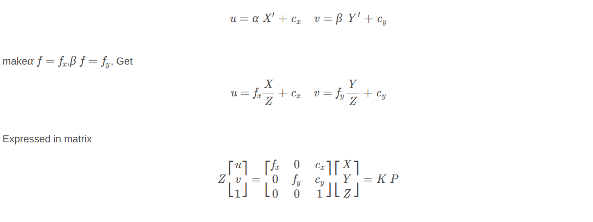
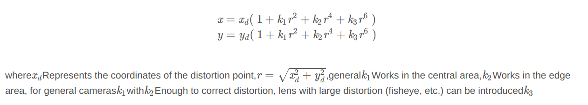

This article mainly introduces the imaging principle of the monocular camera model 

# Monocular camera model

The mapping relationship of the monocular camera model is mainly described by the pinhole model, and the distortion process of the light projected onto the imaging plane is described by the distortion model. The three-dimensional points in space are projected on the imaging plane of the camera through these two models, and then converted into a pixel coordinate system, forming a complete mapping relationship.

## Pinhole model

The pinhole model describes the relationship between a beam of light passing through the pinhole and projecting the image behind the pinhole. The principle is similar to the small hole imaging in physics. Here we first define several coordinate systems / planes:

1. **Camera coordinate system**: This coordinate system is to see the world coordinate system from the perspective of the camera, and set the space point in itPPThe coordinates ofP are[ X ,Y ,Z ]

2. **Imaging plane**: refers to the plane inside the camera where the spatial coordinates are projected through the pinhole. This plane is usually inside the camera, and the spatial coordinate points are located on both sides of the camera's optical center (pinhole). When simplifying the model, you can symmetric To the front of the camera, on the side of the space point, the distance from the imaging plane to the optical center is the focal lengthfff , the coordinate point on the imaging plane **P**
 The coordinates of are [X′,Y′,Z′]
 
3. **Pixel coordinate system** : It can be considered to coincide with the imaging plane of the camera, but the coordinate points in the imaging plane are sampled to each pixel point.[u,v] means that its origin is located in the upper left corner of the image, and it differs from the imaging plane by a zoom and a translation

Based on the similar relationship of the pinhole model, the transformation relationship between the point on the imaging plane and the point under the camera coordinate system is as follows:

Further assume that the relationship between the pixel coordinate system and the imaging plane is:u  axis zoomedα  times, in zoomed on the v axisβ  times, while the origin is shifted [Cx,Cy]^T (the origin of the imaging plane is at the center of the plane), the relationship is as follows:
  
  
  
here K is the so-called camera internal parameter matrix,P  is the coordinate of the space coordinate point in the camera coordinate system, and there is also a space transformation with the coordinate in the world coordinate system, which will be described in the following three-dimensional rigid body motion. Here, the pixel coordinates are expressed by homogeneous coordinates, that is, the original two-dimensional coordinates are expanded into three-dimensional coordinates (the third dimension is 1) to facilitate matrix operations.

## Distortion model
The distortion model is mainly divided into radial distortion and tangential distortion. Radial distortion is caused by the influence of the shape of the lens on the propagation of light. The lens makes the actual straight line become a curve in the picture, and usually radial symmetry, the closer to the edge of the image the more obvious; In the process, the parallelism error between the lens and the imaging plane is caused.

**Radial distortion**

 
 
**Tangential distortion**
 
 