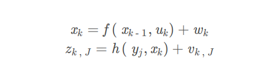
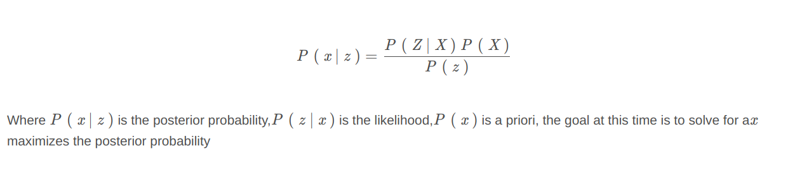
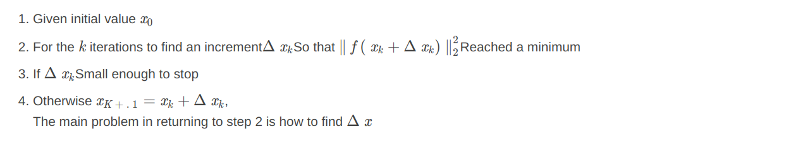
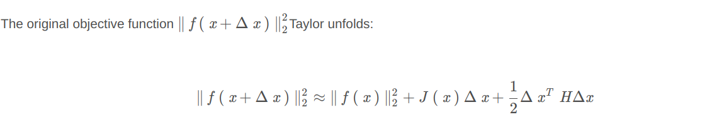
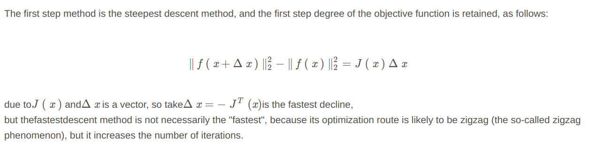

# Nonlinear optimization

In the SLAM problem, there are two main ways to estimate the state of the robot itself: a filter-based method (Kalman filter, Particle filter, etc.) and a method based on nonlinear optimization. The current mainstream SLAM schemes use nonlinear optimization

## State estimation

The classic SLAM model is mainly composed of a **motion model** and an **observation model**, and its equation is as follows

In the traditional filter-based scheme, the state estimation is divided into two steps: **motion update** and **observation update**. From the perspective of probability, the input data uis known u  and observation data Under the condition of z , calculate the state  x conditional probability distribution,x={X1, . . . ,Xn, Y1, . . . , Ym} , Including the robot's own pose and the waypoints in the environment, using Bayes' rule:

Unknown a priori, solve the maximum likelihood problem, that is, under what state is the most likely to produce current observation data
Here, the state estimation problem is converted into a least squares problem

## Nonlinear optimization

As mentioned above, the state estimation problem is a nonlinear least squares problem, and it is inconvenient to directly solve it with the derivative zero, so it is usually solved iteratively, the steps are as follows

**First and second step method**

**One step method**

**Second step method**

The second-degree method is **Newton's method**, and the Taylor expansion of the objective function is about Δx\ Delta xDerivative ofΔx and make it 0

**Newton's method** is mainly the need to calculate the Hessian matrix. It is more difficult to solve large-scale SLAM problems.

1. Gauss-Newton
2. Levenberg-Marquardt Method

Levenberg-Marquardt method is mainly to solve the drawbacks of the Gauss-Newton method, which increment calculation equation is as follows:

